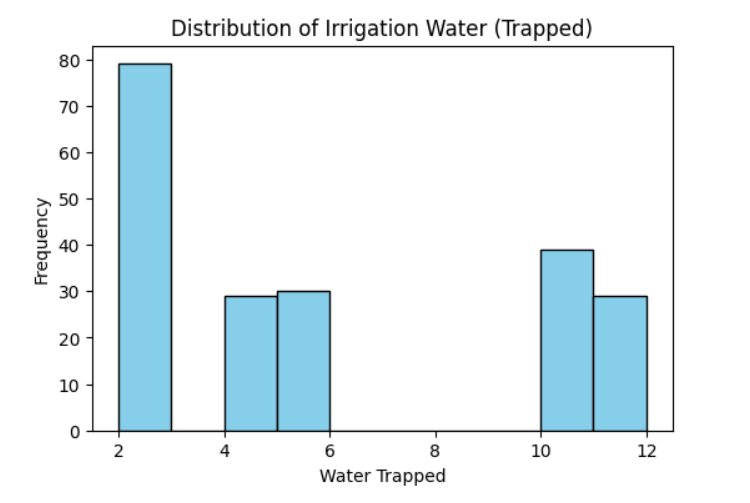
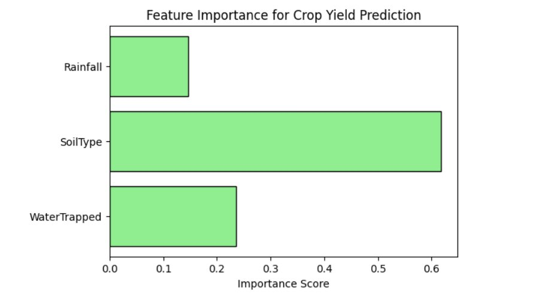
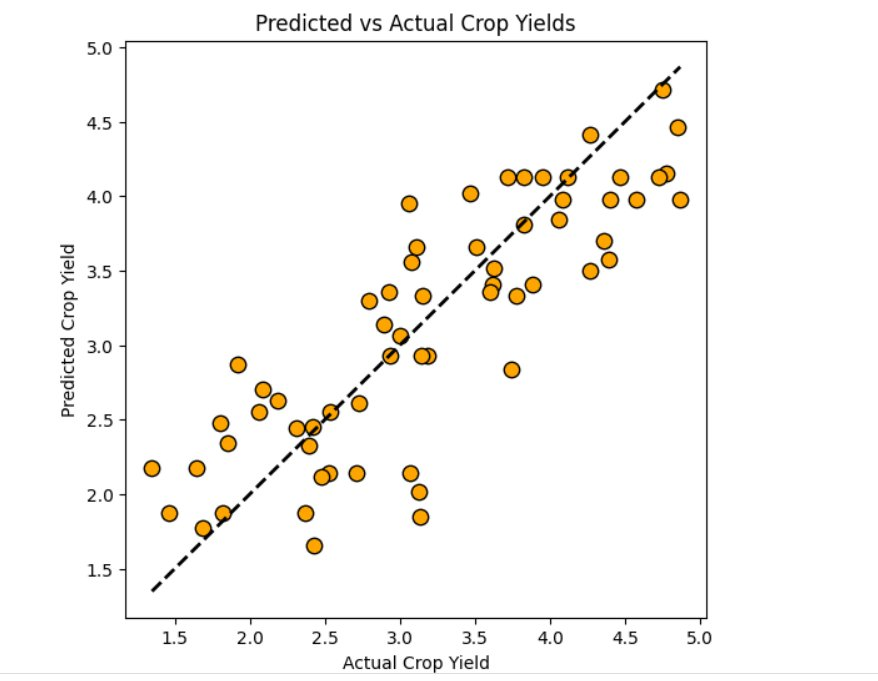

# Crop Yield Prediction using Rain Water Trapping & Machine Learning

This project is a small experiment where I tried to combine a **DSA concept** with **Machine Learning**.  
I used the well-known **Trapping Rain Water problem** to calculate how much rainwater can be stored based on land elevation, and then used that value to help predict **crop yield**.

---

## What this project is about

- Applying a **DSA algorithm** in a real-world scenario
- Using **feature engineering** for an ML model
- Predicting crop yield using simple and explainable logic

**Tech stack used:**
- Python
- Pandas
- Matplotlib
- Scikit-learn

---

## How it works

### 1. Rain Water Trapping Logic
I used the **two-pointer approach** to calculate how much water can be trapped between elevation bars.  
This trapped water represents **available irrigation water** — the idea being that land with valleys between elevations retains more water after rainfall, which benefits crop growth.

The final trapped water value is stored as a new column called `WaterTrapped`.

---

### 2. Data Processing
- Elevation values are converted from strings to integer lists
- Soil types are label-encoded into numbers (Loamy → 0, Clay → 1, Sandy → 2)
- Rainwater trapped is calculated for each row using the two-pointer algorithm

---

### 3. Machine Learning Model
To keep things simple and interpretable, I used a **Decision Tree Regressor**.

**Input features:**
| Feature | Description |
|---|---|
| `WaterTrapped` | Water retained by terrain shape (from DSA algorithm) |
| `SoilType` | Encoded soil category (0=Loamy, 1=Clay, 2=Sandy) |
| `Rainfall` | Rainfall in mm |

**Output:** `CropYield`

The data is split 70/30 into training and testing sets.

---

### 4. Model Performance

| Metric | Value |
|---|---|
| Mean Squared Error (MSE) | 0.2720 |
| Root Mean Squared Error (RMSE) | 0.5216 |

The RMSE of ~0.52 means predictions are off by about half a unit of crop yield on average, which is reasonable given the small synthetic dataset and a single Decision Tree (no ensemble).

---

### 5. Visual Analysis

**Distribution of Irrigation Water (Trapped)**  
Shows how water trapping values are distributed across the dataset — most land profiles trap either low (≈2 units) or high (≈10–12 units) amounts of water, with fewer in between.

---

**Feature Importance**  
Soil type is the dominant predictor (~62%), followed by water trapped (~23%) and rainfall (~15%). This makes agricultural sense — soil composition strongly determines how water is absorbed and retained.

---

**Predicted vs Actual Crop Yields**  
Points close to the dashed diagonal line indicate accurate predictions. The model performs well across the yield range, with some scatter at mid-range values — a typical Decision Tree behaviour.

---

## Key Design Decisions

- **Why Decision Tree?** Interpretable and works well with mixed feature types (numerical + encoded categorical). Easy to explain in terms of split rules on WaterTrapped, SoilType, and Rainfall.
- **Why label encoding over one-hot?** Decision Trees split on thresholds, so they don't assume a mathematical relationship between encoded values — making label encoding appropriate here.
- **Why this feature engineering approach?** The Trapping Rainwater algorithm computes a meaningful hydrological property directly from raw terrain data, making it a domain-relevant engineered feature rather than an arbitrary transformation.

---

## Potential Improvements

- Use cross-validation instead of a single train/test split for more reliable evaluation
- Try ensemble models (Random Forest, XGBoost) to reduce Decision Tree variance
- Incorporate real agricultural data with GPS coordinates, seasonal variation, and sensor readings
- Add features like temperature, humidity, crop type, and historical yield data
